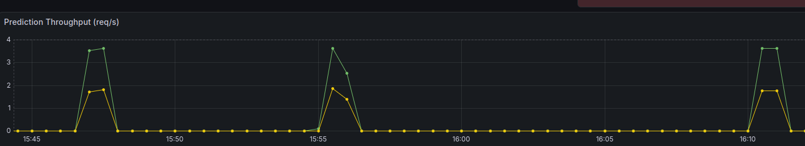

# Continuous experimentation

## Feature difference to test
The feature difference between the A and B group is the implementation of a message length verification on the applications input field. Every message that the user tries to send, that has less than 6 characters, will not be sent to the backend. 

## Metric to measure
The metric that we will measure is the amount of requests per second that the backend receives from the application.

## Hypothesis
Our hypothesis is that by implementing this feature, the backend will receive fewer requests per second.

We think this will happen because some of the messages will be filtered out on the client side before even reaching the backend. This will reduce the load on the backend. In the worst case the messages that reach the backend will remain the same as before, but it will never give an increase in requests.

## Experiment design
The experiment will be designed as follows:

There will be versions both the application and the model service that will be deployed. One will have the length verification and be labeled as the canary, while the other will not have the length verification and won't have a specific label.

To see if the canary version will have fewer requests per second, we will send a sequence of requests containing a message from a predefined set. The messages will vary in length, some being shorter than 6 characters and some being longer. Both of the versions will receive the same sequence of requests.

Of the set of messages, half of them will be shorter than 6 characters, and the other half will be longer than 6 characters. This way we can see how the length verification affects the number of requests that reach the backend.

The sequence of requests will be of length 200.


The script to send the requests is as follows:
```shell
messages=(
  ""                          # empty
  "Hi"                        # 2 chars
  "OK"                        # 2 chars
  "Yes"                       # 3 chars
  "No"                        # 2 chars
  "Wait"                      # 4 chars
  "Done"                      # 4 chars
  "K"                         # 1 char
  "Bye"                       # 3 chars
  "Thx"                       # 3 chars
  "Hello there!"              # longer
  "How are you doing?"        # longer
  "Just checking in"          # longer
  "Meeting at 3pm"            # longer
  "Don't forget the deadline" # longer
  "Great work today"          # longer
  "See you tomorrow"          # longer
  "Quick question for you"    # longer
  "Thanks for your help"      # longer
  "Running a bit late"        # longer
)

for i in {1..200}; do
  random_msg="${messages[$RANDOM % ${#messages[@]}]}"
  
  curl -s -o /dev/null -w "stable req $i -> %{http_code}\n" \
    -H "Host: sms.local" \
    -H "Content-Type: application/json" \
    -b "user-experiment=stable" \
    -d "{\"sms\":\"$random_msg\"}" \
    "http://192.168.56.95/sms"

  curl -s -o /dev/null -w "stable req $i -> %{http_code}\n" \
    -H "Host: sms.local" \
    -H "Content-Type: application/json" \
    -b "user-experiment=canary" \
    -d "{\"sms\":\"$random_msg\"}" \
    "http://192.168.56.95/sms"
done
```

To run the experiment, you need to have the VM cluster provisioned and the applications deployed using the instructions in the deployment guide. When the cluster is running, follow the documentation to get access to the grafana dashboard to monitor the requests per second metric. Navigate to the `DODA - A3 Application Monitoring` dashboard. Now you can run the above script on the CTRL VM to send the requests to both versions of the application. When the grafana dashboard is refreshed, you will be able to see the requests per second for both versions. Not that the colours in the graph might differ from the ones shown in our image below.

If you want to change the number of total requests sent, you can modify the value in the for loop to the desired amount.


To run the experiment on the minikube cluster, make sure to have the cluster deployed and that the application is installed. After that you need to execute the following command:
```bash 
kubectl port-forward -n istio-system svc/istio-ingressgateway 8080:80
```

The only change needed in the above script is to replace the IP address by `localhost:8080`. Then you can run the script directly on your local machine.

## Results
After running the experiment, we observed the following results:

The control version had peaks of 3.64 requests per second for every run of the experiment. The canary version had peaks between 1.71 and 1.85 requests per second.

This indicates that the canary version received roughly half the amount of messages compared to the normal version. This aligns with the setup of our experiment, where half the possible messages were shorter than 6 characters and thus filtered out by the length verification feature. It varies a bit due to the randomness of the message selection.



In the above graph taken directly from grafana, you can see the requests per second for both the normal and the canary version. The green line represents the normal version, and the yellow line represents the canary version with the length verification feature. There are three runs in the above graph, all three showing consistent results.

## Conclusion
Based on the results of the experiment, we can conclude that our hypothesis was correct. The implementation of the message length verification feature did indeed reduce the number of requests per second that the backend received.

It is noteworthy that the real world reduction would depend on the actual distribution of the message lengths sent by the users. But this experiment has shown that the messages that are short, will not reach the backend, thus reducing the load on it.


