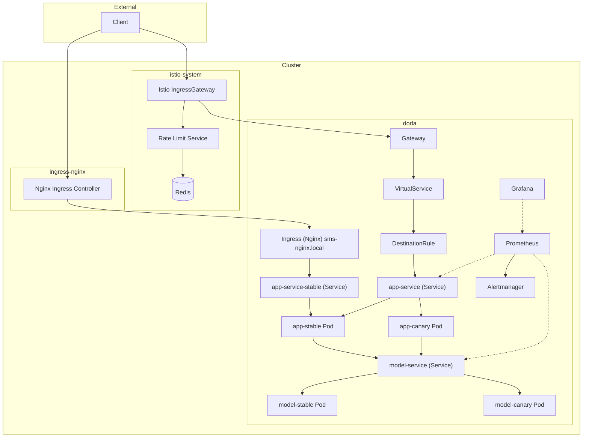
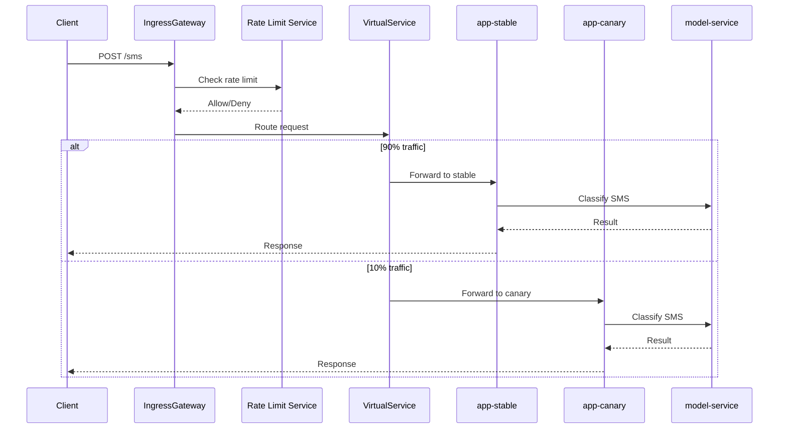
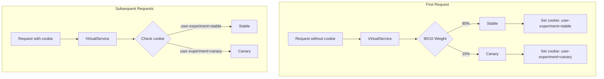
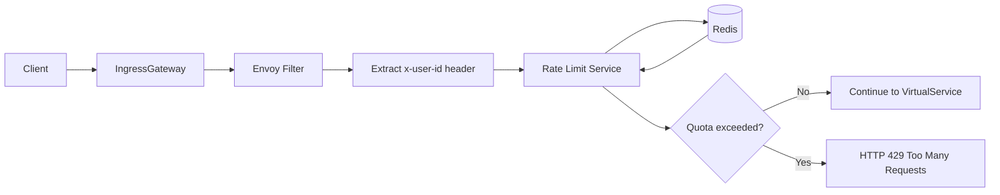

# Deployment Architecture & Data Flow

## High Level System Overview

The application itself consists of a **frontend service** that handles user interaction and a **backend model service** that performs spam classification. Supporting these application components is an **operational layer** that defines how the cluster is created, prepared, and populated with resources.

---

## Operational Context

Although this document focuses on Kubernetes and Istio, the deployment exists within a broader operational context:
- **Vagrant + Ansible** are used to create and prepare the Kubernetes cluster itself.
- **Helm** is used to deploy all application and mesh resources into that cluster.
- **Docker Compose** offers a lightweight local orchestration alternative.

These layers support the deployment but do not change the conceptual request flow inside the cluster.

---

## Cluster Foundation: Vagrant and Ansible

The Kubernetes cluster used for deployment is created on local virtual machines.

- **Vagrant** defines the virtual machine topology (controller and workers).
- **Ansible** configures those machines into a functioning Kubernetes cluster and installs required platform components (e.g. networking, Istio).

From a deployment perspective, this means:
- The cluster is **self-managed**, not a managed cloud service.
- Capabilities such as load-balanced ingress must be explicitly provided.
- Istio is installed **before** application deployment and is treated as part of the platform layer.

Once provisioning is complete, the result is a ready-to-use Kubernetes cluster that behaves like a small production environment.

---

## Application Deployment: Helm as the Interface

All application and mesh resources are deployed into Kubernetes via a **Helm chart**.

Helm acts as the **deployment interface** between:
- the prepared Kubernetes + Istio platform,
- and the application-specific resources.

Conceptually, the Helm chart defines:
- frontend and backend workloads,
- Kubernetes Services for internal communication,
- Istio resources for ingress and routing,
- additional infrastructure components such as rate limiting and monitoring.

Helm centralizes configuration (e.g. hostnames, routing weights, cookie settings) without embedding operational logic into the services themselves.

---

## Local Orchestration: Docker Compose

Docker Compose is used as a **supporting operational mode** rather than the primary deployment target.

Conceptually, Docker Compose:
- runs the frontend and backend together on a single machine,
- uses environment variables to connect services,
- mirrors the same service boundaries used in Kubernetes.

This allows developers to understand and reason about the system without a cluster, but the **final architecture and experiments are defined at the Kubernetes/Istio level**.

---

## Core Application Components

### Frontend Application (`app`)

The frontend is a Spring Boot service that is packaged and distributed as a container image. it:
- exposes a web UI and REST endpoint at `/sms`,
- accepts SMS input from users,
- delegates classification to the backend model service,
- returns results to the user.

In the cluster, the frontend runs as **two parallel deployments**:
- a **stable** version,
- a **canary** version.

Both versions are exposed via a single Kubernetes Service and are differentiated only by Istio routing.

The frontend includes the `lib-version` library, which provides runtime version awareness.

---

### Backend Model Service (`model-service`)

The backend provides an HTTP API for spam classification and is also packaged as a container image with a **stable** version, and a **canary** version.

Key characteristics:
- deployed as a Kubernetes Deployment,
- exposed only internally within the cluster,
- used exclusively by the frontend service.

Model artifacts are loaded at runtime rather than embedded in the image, allowing the service to remain decoupled from specific model versions.

---

### Version-aware Library (`lib-version`)

A Maven library used by the frontend to expose its name and version at runtime.

It is not deployed independently; instead, it is bundled into the frontend container image and serves as an internal dependency.

---

## Deployed Resources Overview

The deployment consists of the following Kubernetes and Istio resources:
- **Istio IngressGateway**: Entry point for all external HTTP traffic into the cluster.
- **Istio Gateway**: Binds the IngressGateway to the application hostname and port.
- **Istio VirtualService**: Defines request routing rules, including the 90/10 canary split.
- **Istio DestinationRule**: Defines stable and canary subsets and sticky-session behavior.
- **app-service**: Kubernetes Service exposing the frontend application internally.
- **Frontend Deployments**: Externally available application
- **model-service**: Internal backend service used for spam classification.
- **Rate limiting components**: Rate limit service and Redis.
- **Observability stack**:
  - Prometheus
  - Grafana

Istio itself is installed during cluster provisioning and is referenced by the Helm chart, which deploys all application-level and mesh resources.

---

---

## External Access: Entry Point Definition

The application exposes a single external HTTP entry point:
- **Hostname:** `sms.local`
- **Port:** `80`
- **Path:** `/sms`
- **Headers:**
  - none required for normal usage
  - `x-user-id` used only for rate limiting

All external traffic enters through the Istio IngressGateway.

---

## Request Flow Through the Deployment

### Typical Request Path

1. A client sends a request to `http://sms.local/sms`.
2. The request enters the cluster via the **Istio IngressGateway**.
3. Global rate limiting is evaluated at the gateway.
4. Istio routing rules determine whether the request is sent to the stable or canary frontend.
5. The frontend forwards the SMS to the backend model service.
6. The classification result flows back to the client.

---

---

## Canary Experiment and Traffic Routing

### Canary Setup

Two versions are deployed simultaneously:

- **stable**
- **canary**

### Traffic Split and Routing Decision

- A **90/10 traffic split** is configured in the Istio VirtualService.
- The routing decision is taken by Envoy at the IngressGateway.
- DestinationRules define the available subsets but do not decide the split.

### Sticky Sessions

To ensure experimental consistency:
- the first request is routed according to the 90/10 split,
- a cookie (e.g. `user-experiment`) records the assigned subset,
- subsequent requests with the cookie are routed to the same version,
- the cookie has a configurable TTL.

---

---

## Additional Use Case: Global Rate Limiting

### Location and Purpose

Global rate limiting is implemented **at the Istio IngressGateway**, before application routing.

This ensures:
- consistent enforcement across all replicas,
- protection of backend resources,
- separation between traffic control and application logic.

### Conceptual Flow

1. Envoy extracts the `x-user-id` header.
2. A centralized rate limit service is queried.
3. Redis stores request counters.
4. Requests exceeding the quota are rejected with HTTP 429.
5. Allowed requests continue to routing and application handling.

---

---

## Observability Components

The deployment includes monitoring components that are deployed alongside the application:
- **Prometheus** for metric collection,
- **Grafana** for visualization.

These components are part of the deployment topology but do not participate in request routing or experimentation decisions.
