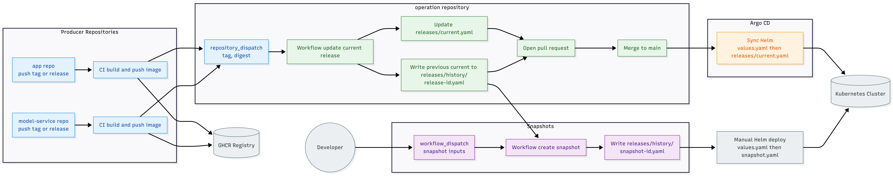

# Extension Proposal: Cross-Repository Version Management for Reproducible Releases

## 1. Current Workflow and Identified Shortcomings
The project uses a multi-repository setup: app and model-service build and publish container images via CI (as introduced in A1), while Kubernetes deployment configuration is centralized in the operation repository. Releasing a new version is therefore a cross-repo step: after a producer repo publishes a new image, developers must manually update image references in Helm values before deploying the cluster.

The core shortcoming is that the project achieves artifact versioning, meaning each repo can release a specific image build with a version identifier, but it lacks system versioning, meaning there is no single, explicit representation of the deployed system state. As a consequence, the “current release” is implicit and manually maintained, which increases the likelihood of configuration drift and can lead to shortcuts such as relying on floating tags, for example `:latest`, instead of pinning an exact version or digest, an approach that both Kubernetes and Helm explicitly warn against.

Furthermore, the lack of a single declarative system snapshot for each experiment weakens reproducibility and traceability. In A4’s continuous experimentation, metrics and Grafana dashboards are only meaningful if they can be traced back to the exact combination of image versions and experiment parameters, such as stable/canary enablement, weights, and sticky-session settings, that produced them. Without an explicit snapshot, reproducing a past result or rolling back to the state that generated it requires manually reconstructing both image versions and Helm values from past changes across repositories. While this is most visible in the A4 canary experiments, the same issue extends to other experiment-like changes across the cluster (e.g., changes to monitoring or alerting configuration), where outcomes depend on specific chart values and component versions.

## 2. Proposed Extension

To address the shortcomings above, we propose introducing a system-level release mechanism that makes the deployed state explicit, reviewable, and reproducible.

We introduce a system Bill of Materials (BOM), implemented as a set of versioned release manifests in the operation repository. In this context, each manifest represents a deployable system snapshot, it records the exact image references for app and model-service, and when needed, it captures the Helm configuration relevant to experimentation. Concretely, the operation repository should contain a `releases/` directory with a single `current.yaml` used as the current desired state, and a `releases/history/` directory that stores both archived releases and experiment snapshots.

In each application repository, a CI workflow can be implemented to run after building and publishing a new image. The workflow should trigger a cross-repository update that opens a pull request against the operation repository. That pull request updates `releases/current.yaml` with the newly produced image reference and, at the same time, bumps the previous content of current.yaml into the history folder as an archived release manifest. This ensures that every change to the “current release” automatically preserves a directly deployable record of the prior system state. This propagation step can be implemented with GitHub Actions using the `repository_dispatch` event, which is intended to trigger workflows based on activity outside the target repository and supports custom event types.

This approach also aligns with GitOps best practices, where a Git repository acts as the single source of truth for the desired cluster state. To follow this model, we can integrate `Argo CD` and configure it to continuously deploy the state declared in the operation repository, for example by applying a base values.yaml together with releases/current.yaml as a values override. Once a pull request generated by the propagation workflow is merged, Argo CD can automatically synchronize the cluster to the updated desired state.

Finally, an explicit snapshot workflow for experiments can be implemented. A separate dispatchable workflow in operation creates a new system snapshot by capturing the image versions from `releases/current.yaml` and combining them with experiment parameters provided as workflow inputs. The result is a new snapshot manifest file under `releases/history/<snapshot-id>.yaml`. These snapshot files are designed to be directly deployable with Helm at any time, so that reproducing an experiment becomes a simple operation, deploying the chart with the snapshot manifest as an additional values file. For example:

```yml
snapshotId: expA4-ContinuousExperiment-2024-06-15
images:
  app:
    image: ghcr.io/<org>/app
    tag: v1.2.3
    digest: sha256:...
  modelService:
    image: ghcr.io/<org>/model-service
    tag: v2.0.1
    digest: sha256:...
experiment:
  canaryEnabled: true
  stableWeight: 90
  canaryWeight: 10
```

The figure below summarizes the proposed release propagation, Argo CD synchronization, and the manual snapshot workflow.




## 3. How to Validate

To test whether the proposed design has the desired effect, we can evaluate each introduced mechanism with a small set of experiments that mirror the real release and experimentation workflow of the project.

### Argo CD integration

Configure an Argo CD Application that points to the operation repository and deploys the Helm chart using `values.yaml` plus `releases/current.yaml` as an override. Validation consists of checking that Argo CD reports the application as **Synced** and that the rendered manifests in the cluster reflect the values pinned in `releases/current.yaml`. A simple check is to compare the running pod image references in the cluster against the tag and digest recorded in `releases/current.yaml`.

### Cross-repo release propagation

Trigger a new release in app or model-service by pushing a new release tag that produces a new image (with a different tag and digest). The expected outcome is that the producer workflow sends a dispatch event and a pull request is automatically opened in the operation repository. After merging the PR, the following conditions should hold:

1. `releases/current.yaml` is updated to the new image reference
2. the previous content of `releases/current.yaml` has been archived as a release manifest under `releases/history/`
3. Argo CD detects the change and automatically rolls out the updated version in the cluster

This can be verified by observing the Argo CD sync status and confirming that the running workloads now use the new image references.

### Snapshot creation and deployment

The snapshot mechanism can be validated either with a newly designed experiment or by replaying an experiment that was already conducted in the past. As an example, we use the A4 continuous experimentation scenario.

Trigger the manual snapshot workflow and provide the experiment parameters used in an A4 continuous experimentation run. The expected outcome is a new file under `releases/history/<snapshot-id>.yaml` that includes the image versions captured from `releases/current.yaml` and the experiment parameters from the workflow inputs.

Reproducibility can then be tested by redeploying the system using Helm with the snapshot file and repeating the same request pattern used in A4:

```bash
helm upgrade --install sms ./charts/<chart-name> -n exp-repro \
  -f values.yaml \
  -f releases/history/<snapshot-id>.yaml
```

If the snapshot is correct, the experiment behavior should match the original run, for example a similar stable/canary traffic split, sticky-session behavior, and comparable Grafana metrics trends when applying the same load pattern. 

## 4. Assumptions and Possible Downsides

This proposal assumes that the team consistently treats `releases/current.yaml` as the official description of the currently deployed system state and keeps the BOM schema stable and compatible with the Helm chart over time.

A possible downside could arise from the cross-release propagation workflow if it is not properly controlled and configured. In that case, it may run too frequently and create more pull requests than necessary. This is especially relevant when app and model-service release close to each other in time, since multiple pull requests updating `releases/current.yaml` can conflict and require rebases or manual coordination. Frequent merges may also trigger repeated Argo CD synchronizations and rollouts within a short window, which increases the risk of disruption during busy release periods.

Snapshot creation is manual and depends on users providing correct experiment inputs, so inconsistent parameter naming or missing metadata can reduce snapshot usefulness. Finally, reproducibility is improved but not absolute, since experiment outcomes can still vary due to cluster load, scheduling, resource contention, or time-dependent external dependencies, even when the declared configuration is identical.


## 5. References

- Kubernetes Documentation – Container Images:  
  “You should avoid using the :latest tag when deploying containers in production as it is harder to track which version of the image is running and more difficult to roll back properly.”  
  https://kubernetes.io/docs/concepts/containers/images/

- Helm Best Practices – Images:  
  “A container image should use a fixed tag or the SHA of the image. It should not use the tags latest, head, canary, or other tags that are designed to be floating.”  
  https://helm.sh/docs/chart_best_practices/pods/#images

- GitHub Actions Documentation – `repository_dispatch`:  
  “A webhook event for triggering workflows for activity outside GitHub.”  
  https://docs.github.com/actions/learn-github-actions/events-that-trigger-workflows#repository_dispatch

- OpenGitOps Principles – Declarative and Versioned System State  
  https://opengitops.dev/

- Argo CD Documentation – Best Practices:  
  https://argo-cd.readthedocs.io/en/stable/user-guide/best_practices/

- Argo CD Documentation – Helm (valueFiles and configuration):  
  https://argo-cd.readthedocs.io/en/latest/user-guide/helm/
